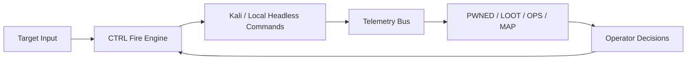

# h3retik v0.0.1

SOTA red teaming operations cockpit: headless Kali execution, gamified operator UX, and evidence-first telemetry.

```text
                            ,--.
                           {    }
                           K,   }
                          /  ~Y`
                     ,   /   /
                    {_'-K.__/
                      `/-.__L._
                      /  ' /`\_}
                     /  ' /
             ____   /  ' /
      ,-'~~~~    ~~/  ' /_
    ,'             ``~~~  ',
   (                        Y
  {                         I
 {      -                    `,
 |       ',                   )
 |        |   ,..__      __. Y
 |    .,_./  Y ' / ^Y   J   )|
 \           |' /   |   |   ||
  \          L_/    . _ (_,.'(
   \,   ,      ^^""' / |      )
     \_  \          /,L]     /
       '-_~-,       ` `   ./`
          `'{_            )
              ^^\..___,.--`
```

## What It Does

- Runs exploit, OSINT, and onchain workflows from one keyboard-first control plane.
- Executes operator actions as reproducible headless CLI commands (`kali` or `local`).
- Captures structured evidence in telemetry streams (`commands`, `findings`, `loot`, `exploits`).
- Maps operations into fast views (`OPS`, `PWNED`, `LOOT`, `MAP`) with OPSEC signal and next actions.

## Why H3retik

- Operator-first design with mode-scoped workflow (`exploit`, `osint`, `onchain`).
- Target-agnostic execution from target URL + discovered evidence.
- Unified runtime: packaged Kali + wrappers + modular pipelines.
- Gamified but professional UX for real operations tempo.

### Peer Framework Comparison

Verification source: public upstream repository descriptions (snapshot checked on **2026-04-17**).

| Repo / Tool | Official focus (upstream) | Unified exploit+OSINT+onchain cockpit | Built-in gamified TUI ops loop | Structured multi-stream telemetry bus | Preconfigured Kali runtime + wrappers |
|---|---|---:|---:|---:|---:|
| `PurpleAILAB/Decepticon` | Autonomous Hacking Agent for Red Team Testing | No | No | No | No |
| `rapid7/metasploit-framework` | Metasploit Framework | No | No | Partial | No |
| `mitre/caldera` | Automated Adversary Emulation Platform | No | No | Partial | No |
| `infobyte/faraday` | Open Source Vulnerability Management Platform | No | No | Yes | No |
| `owasp-amass/amass` | In-depth attack surface mapping and asset discovery | No | No | Partial | No |
| `smicallef/spiderfoot` | OSINT automation for threat intelligence and attack-surface mapping | No | No | Partial | No |
| **`nativ3ai/h3retik`** | **SOTA multi-domain red teaming cockpit** | **Yes** | **Yes** | **Yes** | **Yes** |

Notes:
- Comparison is at repository workflow level, not isolated tool capability level.
- h3retik unifies these domains in one operational runtime.

## One-Liner Install

### Local repo one-liner

```bash
bash -lc 'cd /Users/native/Desktop/heretic/juiceshop-blackbox && ./scripts/install_h3retik.sh && export PATH="$HOME/.local/bin:$PATH" && h3retik up && h3retik'
```

### GitHub bootstrap one-liner

```bash
bash -lc 'curl -fsSL https://raw.githubusercontent.com/nativ3ai/h3retik/main/scripts/bootstrap_h3retik.sh | bash'
```

After install:

```bash
export PATH="$HOME/.local/bin:$PATH"
h3retik up
h3retik
```

## Command Surface

```bash
h3retik                          # start kali + launch TUI
h3retik up                       # start/build kali service
h3retik down                     # stop stack
h3retik target ...               # scripts/targetctl.py passthrough
h3retik pipeline ...             # scripts/security_pipeline.py passthrough
h3retik observatory ...          # scripts/observatory_runner.py passthrough
h3retik kali "<cmd>"             # execute command in kali container
h3retik doctor                   # runtime checks
```

## Mounted Runtime + Suite

- Kali image: `h3retik/kali:v0.0.1`
- Compose service: `kali` (`jsbb-kali`)
- Mounted volumes:
  - `./telemetry -> /telemetry`
  - `./artifacts -> /artifacts`
- Wrapper packs:
  - `kali-headless/osint-*`
  - `kali-headless/onchain-*`

Capability matrix: [`docs/CAPABILITIES.md`](docs/CAPABILITIES.md)

## Documentation Index

- Literate architecture: [`docs/LITERATE_PROGRAMMING.md`](docs/LITERATE_PROGRAMMING.md)
- Release design notes: [`docs/V0_0_1_LITERATE.md`](docs/V0_0_1_LITERATE.md)
- Capability matrix: [`docs/CAPABILITIES.md`](docs/CAPABILITIES.md)
- Agent skill profile: [`SKILL.md`](SKILL.md)
- Contribution workflow: [`CONTRIBUTING.md`](CONTRIBUTING.md)
- Security policy: [`SECURITY.md`](SECURITY.md)

## Operational Model (h3retik vs typical red-team TUI)

| Dimension | Typical toolchains | h3retik v0.0.1 |
|---|---|---|
| Execution model | Mixed terminals and ad hoc scripts | Unified headless CLI bus (`kali` + `local`) |
| Evidence model | Scattered outputs | Structured telemetry (`commands/findings/loot/exploits`) |
| Workflow control | Script-level only | TUI CTRL + map/pwn/loot loop |
| Domain coverage | Usually single-domain | Exploit + OSINT + onchain in one cockpit |
| Operator guidance | Limited | OPSEC cues + next-best actions |



## Quick Start

```bash
h3retik target set --kind custom --url http://127.0.0.1:8080
h3retik up
h3retik
```

## Governance

- License: Apache 2.0 (`LICENSE`)
- Contribution guide: [`CONTRIBUTING.md`](CONTRIBUTING.md)
- Security policy: [`SECURITY.md`](SECURITY.md)
