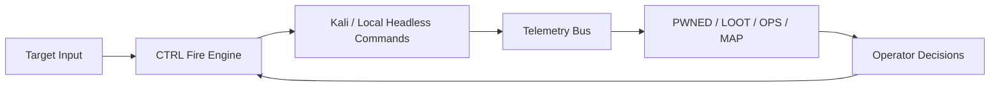

# h3retik v0.0.3

SOTA red teaming operations cockpit: headless Kali execution, gamified operator UX, and evidence-first telemetry.

```text
                            ,--.
                           {    }
                           K,   }
                          /  ~Y`
                     ,   /   /
                    {_'-K.__/
                      `/-.__L._
                      /  ' /`\_}
                     /  ' /
             ____   /  ' /
      ,-'~~~~    ~~/  ' /_
    ,'             ``~~~  ',
   (                        Y
  {                         I
 {      -                    `,
 |       ',                   )
 |        |   ,..__      __. Y
 |    .,_./  Y ' / ^Y   J   )|
 \           |' /   |   |   ||
  \          L_/    . _ (_,.'(
   \,   ,      ^^""' / |      )
     \_  \          /,L]     /
       '-_~-,       ` `   ./`
          `'{_            )
              ^^\..h3retik
```

## What It Does
- Gamifies redteaming hacking opex through an intuitive TUI
- Runs exploit, OSINT, onchain, and co-op/C2 workflows from one keyboard-first control plane.
- Executes operator actions as reproducible headless CLI commands (`kali` or `local`).
- Captures structured evidence in telemetry streams (`commands`, `findings`, `loot`, `exploits`).
- Maps operations into fast views (`OPS`, `PWNED`, `LOOT`, `MAP`) with OPSEC signal and next actions.

## Why H3retik

- Operator-first design with mode-scoped workflow (`exploit`, `osint`, `onchain`, `coop`).
- Target-agnostic execution from target URL + discovered evidence.
- Unified runtime: packaged Kali + wrappers + modular pipelines.
- Gamified but professional UX for real operations tempo.

### Peer Feature Baseline (Operator-Relevant)

Verification source: public upstream repository docs/readmes (snapshot checked on **2026-04-17**).

| Professional red-team feature | `PurpleAILAB/Decepticon` | `rapid7/metasploit-framework` | `mitre/caldera` | `infobyte/faraday` | **`nativ3ai/h3retik`** |
|---|---:|---:|---:|---:|---:|
| Exploit module ecosystem (built-in) | Partial | Yes | Partial | No | Partial |
| Adversary emulation / kill-chain orchestration | Yes | Partial | Yes | No | Partial |
| C2 / agent management in-core | Partial | Partial | Yes | No | Partial |
| Credential attack workflows (online/offline) | Partial | Yes | Partial | No | Yes |
| Operator-in-the-loop UX (fast steering) | Partial | Partial | Partial | Yes | **Yes** |
| Evidence capture for later reporting/audit | Partial | Partial | Partial | Yes | **Yes** |
| Multi-tool unification into one loop | Partial | Partial | Partial | Partial | **Yes** |
| Preconfigured Kali runtime + wrappers | No | No | No | No | **Yes** |
| Integrated OSINT lane in same runtime | No | No | No | No | **Yes** |
| Integrated onchain lane in same runtime | No | No | No | No | **Yes** |

Notes:
- `Yes` = ships as a first-class, default workflow in the core project/runtime.
- `Partial` = achievable via plugins/manual composition/integration, but not the default operator loop.
- This table compares “what a working operator gets out of the box”, not what can be built with enough glue.

## Installation Requirements (Fresh Machine)

| Requirement | Needed for | Required |
|---|---|---|
| `docker` + `docker compose` plugin | Kali runtime, wrappers, co-op stack | Yes |
| `git` | bootstrap/source install | Yes |
| `bash` | launcher + installer scripts | Yes |
| `python3` | `target`/`pipeline`/`observatory` helpers | Yes |
| `go` | local build of `juicetui` (`h3retik build`) | Recommended |

Runtime footprint:
- Current Kali image size on disk: ~`17–18GB` (`h3retik/kali:v0.0.3`).
- Recommended free disk for first install/build + artifacts: `30GB+` (better: `40GB`).
- Recommended memory: `8GB+` (`16GB` preferred for heavy scan/fuzz workloads).

## One-Liner Install

### Source install one-liner (global path)

```bash
bash -lc 'SRC="${H3RETIK_SRC_DIR:-$HOME/.local/src/h3retik}"; rm -rf "$SRC"; git clone https://github.com/nativ3ai/h3retik.git "$SRC" && cd "$SRC" && ./scripts/install_h3retik.sh && export PATH="$HOME/.local/bin:$PATH" && h3retik up && h3retik'
```

### GitHub bootstrap one-liner

```bash
bash -lc 'curl -fsSL https://raw.githubusercontent.com/nativ3ai/h3retik/main/scripts/bootstrap_h3retik.sh | bash'
```

What the all-in-one installer does:
- Pulls `nativ3ai/h3retik` source to `~/.local/src/h3retik` (or updates it).
- Copies runtime payload to `~/.local/share/h3retik/<version>`.
- Installs global launcher at `~/.local/bin/h3retik`.
- Creates writable runtime dirs: `telemetry/`, `artifacts/`, `bin/`.
- Builds `bin/juicetui` if `go` is installed (otherwise build happens later when available).
- Does not auto-start containers; runtime comes up with `h3retik up` or first `h3retik`.

After install:

```bash
export PATH="$HOME/.local/bin:$PATH"
h3retik up
h3retik
```

Optional agent skill wiring (for agent runtimes that support local skills):

```bash
mkdir -p ~/.codex/skills/h3retik
ln -sf "$(pwd)/SKILL.md" ~/.codex/skills/h3retik/SKILL.md
```

- Local skill source: [`SKILL.md`](SKILL.md)
- Optional remote skill source: `https://raw.githubusercontent.com/nativ3ai/h3retik/main/SKILL.md`

## Command Surface

```bash
h3retik                          # start kali + launch TUI
h3retik attach                   # attach TUI to existing running kali container (no compose up)
h3retik --kali-container my-kali tui
h3retik --kali-image my/kali:tag up
h3retik up                       # start/build kali service
h3retik down                     # stop stack
h3retik build-kali               # build kali image
h3retik target ...               # scripts/targetctl.py passthrough
h3retik pipeline ...             # scripts/security_pipeline.py passthrough
h3retik observatory ...          # scripts/observatory_runner.py passthrough
h3retik kali "<cmd>"             # execute command in kali container
h3retik coop <cmd>               # caldera co-op helpers (check/up/status/stop/api/report)
h3retik doctor                   # runtime checks
```

## Existing Kali / External Runtime

h3retik can run only the TUI against an already-running container. If `jsbb-kali` already exists, `h3retik` will reuse it automatically; otherwise set the container name explicitly.

```bash
export H3RETIK_KALI_CONTAINER=<your-kali-container>
export H3RETIK_SKIP_UP=1
h3retik tui
```

Or with one command:

```bash
h3retik --kali-container <your-kali-container> attach
```

For the default container name, no extra flag is needed if `jsbb-kali` is already running:

```bash
h3retik
```

Optional image override for compose-managed mode:

```bash
export H3RETIK_KALI_IMAGE=<custom-image-tag>
h3retik up
```

Equivalent one-shot flag:

```bash
h3retik --kali-image <custom-image-tag> up
```

Important:
- Some actions fail if your external Kali image does not include required wrappers/packages.
- Required wrappers are documented in `docs/CAPABILITIES.md` (`osint-*`, `onchain-*`, `coop-*`).
- `CTRL` runtime can be changed in-TUI: `TARGET -> KALI Runtime Container (Type)` and `TARGET -> KALI Runtime Image (Type)`.
- FIRE options are capability-aware: missing Kali tools are filtered/locked so non-runnable commands are not presented as ready.

Minimum compatibility checklist for external Kali images:
- Base runtime: `bash`, `python3`, `curl`, `jq`, `git`.
- Exploit lane core: `nmap`, `ffuf`, `nikto`, `sqlmap`, `hydra`, `medusa`, `nuclei`, `metasploit-framework`.
- OSINT lane core: `theharvester`, `bbot`, `spiderfoot`, `recon-ng`, `rengine` (or equivalent callable wrapper).
- Onchain lane core: `slither`, `myth` (mythril), `forge`, `cast`, `echidna`, `medusa`, `halmos`.
- Co-op lane core: `caldera` + wrappers (`coop-caldera-*`).

If you want full feature parity, use `h3retik up` with the default bundled Kali image.

## Runtime + Suite

- Kali image: `h3retik/kali:v0.0.3`
- Compose service: `kali` (`${H3RETIK_KALI_CONTAINER:-jsbb-kali}`)
- Mounted volumes:
  - `./telemetry -> /telemetry`
  - `./artifacts -> /artifacts`
- Wrapper packs:
  - `kali-headless/osint-*`
  - `kali-headless/onchain-*`
  - `kali-headless/coop-*`

Capability matrix: [`docs/CAPABILITIES.md`](docs/CAPABILITIES.md)

## Co-op UX Flow (CALDERA in TUI)

- Open `CTRL`, press `g` to switch scope to `CO-OP`.
- Use `[]` to choose section (`LAUNCH`, `TARGET`, `FIRE`, `HISTORY`).
- Use `↑/↓` for category selection and `,/.` for options in the selected category.
- In `TARGET`, set CALDERA URL/API key/operation/group.
- In `FIRE`, run the loop: start C2 -> status -> agents -> operations -> report.
- A non-invasive context hint appears in `CTRL` while in `CO-OP` mode to guide next step.

## Repository Includes

- [`cmd/juicetui/`](cmd/juicetui) — TUI source (CTRL/ARCH/OPS/PWNED/LOOT/MAP).
- [`kali-headless/`](kali-headless) — headless wrappers for exploit/OSINT/onchain/co-op.
- [`modules/exploit/`](modules/exploit) — dynamic exploit module manifests.
- [`scripts/`](scripts) — install/bootstrap + target/pipeline orchestration.
- [`docs/`](docs) — literate architecture, scoring, capability matrix, tutorials.
- [`telemetry/`](telemetry) — JSON/JSONL operation streams consumed by the TUI.
- [`artifacts/`](artifacts) — persisted command outputs/evidence bundles.

## Telemetry Contract

h3retik uses JSONL telemetry as source-of-truth for all panes:

- `telemetry/state.json`
- `telemetry/commands.jsonl`
- `telemetry/findings.jsonl`
- `telemetry/loot.jsonl`
- `telemetry/exploits.jsonl`

Telemetry usage by pane:
- `OPS` reads command/event timeline from `commands.jsonl`.
- `PWNED` reads normalized vulnerabilities/impact from `findings.jsonl` + `exploits.jsonl`.
- `LOOT` reads validated artifacts/entities from `loot.jsonl`.
- `ARCH`/`MAP` reads current target and campaign state from `state.json` + correlated findings.

This keeps TUI state and headless execution synchronized, replayable, and exportable.

## Documentation Index

- Literate architecture: [`docs/LITERATE_PROGRAMMING.md`](docs/LITERATE_PROGRAMMING.md)
- Release design notes: [`docs/V0_0_1_LITERATE.md`](docs/V0_0_1_LITERATE.md)
- Capability matrix: [`docs/CAPABILITIES.md`](docs/CAPABILITIES.md)
- TUI operator manual (keys/panels/modes): [`docs/TUI_OPERATOR_REFERENCE.md`](docs/TUI_OPERATOR_REFERENCE.md)
- Operator cheat sheet (fast field card): [`docs/OPERATOR_CHEATSHEET.md`](docs/OPERATOR_CHEATSHEET.md)
- Operator cheat sheet (A4 condensed): [`docs/OPERATOR_CHEATSHEET_A4.md`](docs/OPERATOR_CHEATSHEET_A4.md)
- Pipelines + commands + follow-ups: [`docs/PIPELINES_AND_COMMANDS.md`](docs/PIPELINES_AND_COMMANDS.md)
- Preinstalled tool-by-tool reference: [`docs/TOOLS_REFERENCE.md`](docs/TOOLS_REFERENCE.md)
- Co-op CALDERA tutorial: [`docs/COOP_CALDERA_TUTORIAL.md`](docs/COOP_CALDERA_TUTORIAL.md)
- Scoring model: [`docs/SCORING.md`](docs/SCORING.md)
- Agent skill profile: [`SKILL.md`](SKILL.md)
- Contribution workflow: [`CONTRIBUTING.md`](CONTRIBUTING.md)
- Security policy: [`SECURITY.md`](SECURITY.md)

## Operational Model (h3retik vs typical red-team TUI)

| Dimension | Typical toolchains | h3retik v0.0.3 |
|---|---|---|
| Execution model | Mixed terminals and ad hoc scripts | Unified headless CLI bus (`kali` + `local`) |
| Evidence model | Scattered outputs | Structured telemetry (`commands/findings/loot/exploits`) |
| Workflow control | Script-level only | TUI CTRL + map/pwn/loot loop |
| Domain coverage | Usually single-domain | Exploit + OSINT + onchain + co-op/C2 in one cockpit |
| Operator guidance | Limited | OPSEC cues + next-best actions |



## Quick Start

```bash
h3retik target set --kind custom --url http://127.0.0.1:8080
h3retik up
h3retik
```

## Governance

- License: Apache 2.0 (`LICENSE`)
- Contribution guide: [`CONTRIBUTING.md`](CONTRIBUTING.md)
- Security policy: [`SECURITY.md`](SECURITY.md)
