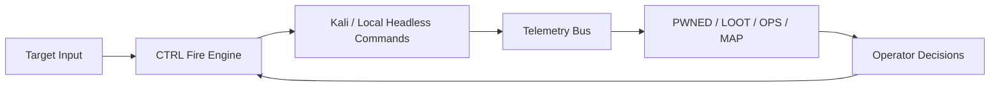

# h3retik v0.0.1

SOTA-oriented red teaming operations cockpit: headless Kali execution + gamified TUI + evidence-first telemetry.

```text
                            ,--.
                           {    }
                           K,   }
                          /  ~Y`
                     ,   /   /
                    {_'-K.__/
                      `/-.__L._
                      /  ' /`\_}
                     /  ' /
             ____   /  ' /
      ,-'~~~~    ~~/  ' /_
    ,'             ``~~~  ',
   (                        Y
  {                         I
 {      -                    `,
 |       ',                   )
 |        |   ,..__      __. Y
 |    .,_./  Y ' / ^Y   J   )|
 \           |' /   |   |   ||
  \          L_/    . _ (_,.'(
   \,   ,      ^^""' / |      )
     \_  \          /,L]     /
       '-_~-,       ` `   ./`
          `'{_            )
              ^^\..___,.--`
```

## Why h3retik

- **Operator-first UX**: fast keyboard navigation, mode-scoped control (`exploit`, `osint`, `onchain`), live telemetry.
- **Headless by default**: every action resolves to CLI execution (`kali` or `local`) with reproducible command trails.
- **Target-agnostic execution**: pipelines/modules run from target URL + discovered evidence, not hardcoded app logic.
- **Gamified clarity**: attack-degree maps, OPSEC meters, compromise posture, and guided next-best actions.

## One-Liner Install

### Local repo one-liner

```bash
bash -lc 'cd /Users/native/Desktop/heretic/juiceshop-blackbox && ./scripts/install_h3retik.sh && export PATH="$HOME/.local/bin:$PATH" && h3retik up && h3retik'
```

### GitHub one-liner (global install script)

```bash
bash -lc 'curl -fsSL https://raw.githubusercontent.com/nativ3ai/h3retik/main/scripts/bootstrap_h3retik.sh | bash'
```

After install:

```bash
export PATH="$HOME/.local/bin:$PATH"
h3retik up
h3retik
```

## Command Surface

```bash
h3retik                          # start kali + launch TUI
h3retik up                       # start/build kali service
h3retik down                     # stop stack
h3retik target ...               # scripts/targetctl.py passthrough
h3retik pipeline ...             # scripts/security_pipeline.py passthrough
h3retik observatory ...          # scripts/observatory_runner.py passthrough
h3retik kali "<cmd>"             # execute command in kali container
h3retik doctor                   # runtime checks
```

## Mounted Runtime + Suite

- **Kali image**: `h3retik/kali:v0.0.1`
- **Compose service**: `kali` (`jsbb-kali` container)
- **Mounted volumes**:
  - `./telemetry -> /telemetry`
  - `./artifacts -> /artifacts`
- **Wrapper packs**:
  - `kali-headless/osint-*`
  - `kali-headless/onchain-*`

See full capability matrix in `docs/CAPABILITIES.md`.

## Literate Programming Docs

- `docs/LITERATE_PROGRAMMING.md` — executable architecture narrative (what, why, where in code).
- `docs/V0_0_1_LITERATE.md` — packaging/release design notes.
- `SKILL.md` — agent/operator skill profile for immediate autonomous usage.

## SOTA Delta (h3retik vs. typical red-team TUI)

| Dimension | Typical toolchains | h3retik v0.0.1 |
|---|---|---|
| Execution model | Mixed/manual terminals | Unified headless CLI bus (`kali` + `local`) |
| Evidence model | Scattered outputs | Structured telemetry (`commands/findings/loot/exploits`) |
| Workflow control | Script-level only | TUI CTRL + map/pwn/loot operational loop |
| OSINT/onchain integration | External ad hoc | Mode-scoped first-class pipelines |
| Operator guidance | Low | Next-best actions + OPSEC + attack posture |



## Quick Start

```bash
h3retik target set --kind custom --url http://127.0.0.1:8080
h3retik up
h3retik
```

## Contributing + Governance

- Contribution guide: `CONTRIBUTING.md`
- Security policy: `SECURITY.md`
- License: Apache 2.0 (`LICENSE`)

---

If you want source-available/no-reuse terms later (non-OSI), switch from Apache-2.0 to a BUSL/PolyForm-style license in the next major release.
